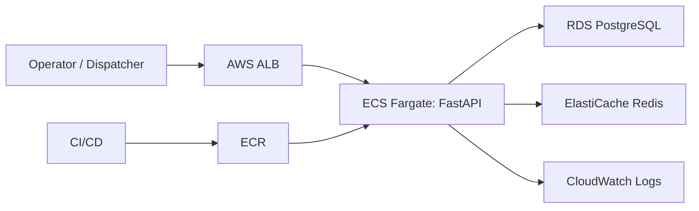

# TMS Architecture

## Goal

Build a new TMS on a production-style stack while keeping the PostgreSQL schema as the source of truth.

## Application layers

- `Flutter`
  - login
  - dashboard
  - order desk
  - dispatch board
- `FastAPI`
  - JWT auth by `login_id`
  - company, driver, vehicle, order, dispatch APIs
  - Redis-backed dashboard summary cache
- `PostgreSQL`
  - authoritative transactional schema
- `Redis`
  - dashboard cache

## AWS runtime

## Next build items

1. Add full CRUD for locations, contacts, charges, settlements, attachments, and GPS logs.
2. Add status transition rules and history writes on every order or dispatch mutation.
3. Add file storage for POD and contract attachments.
4. Add partner portal and driver-focused workflow screens.

